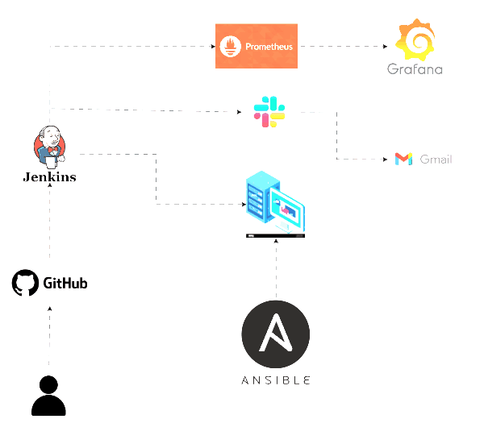

# Automated-Nginx-Deployment

This repository contains the docker-compose and deployment setup for the **Nginx app**

## Table of Contents
- [Overview](#overview)
- [CI/CD Pipeline](#cicd-pipeline)
- [Doecker](#Doecker)
- [Ansible](#Ansible)
- [promtheus](#promtheus)
- [grafana](#grafana)

## Overview

This project automates the deployment for **Nginx app**. The pipeline manages the entire lifecycle Trigger the change on the GitHub to application deployment on Vm.
- `index.html`: containes the main project code.

## CI/CD Pipeline

### Jenkins
The Jenkins pipeline is designed to automate everything to application deployment. It performs the following steps:
1.  Trigger the change on the GitHub.
2.  Build Docker images.
3.  Run Docker Compose on the VM.
4.  Copy index.html to the Nginx Container.
5.  send the deployment status via Slack.  

- `Note`: you can install Jenkins as a container with all dependencies from my docker hub   **docker push yoyo7sniper97/jenkins:latest**  .
 
The Jenkinsfile is located at the root of the project:
- `Jenkinsfile`: Defines the pipeline stages for application deployment.

### Doecker 
- `docker-compose.yml`: used to create Nginx as a container and Map the local html directory to the container.

### Ansible
 - `slave_playbook.yml`: Ansible – Automating instance configuration and Jenkins agent setup

### promtheus
 - `prometheus.yml`: Defines the targets for prometheus.

### grafana

### Prerequisites
- Jenkins for the CI/CD pipeline.
- Docker for containerization.
- Prometheus to collect numeric metrics from services.
- Grafana is used for visualizing the data.
- Slack for sending the deployment notifications.
